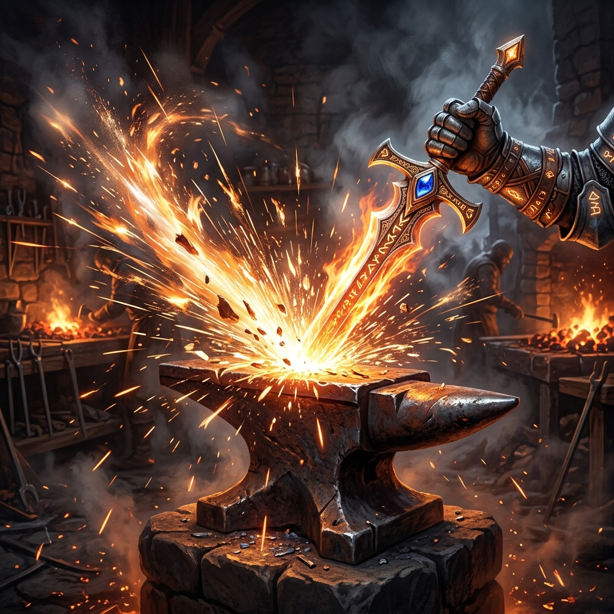

<h1 align="center">
    🏰 Age of Telegram: Empire RPG 🏰
</h1>

<p align="center">
  
</p>

<p align="center">
  <b>The Ultimate Empire-Building RPG Bot for Telegram Groups!</b>
</p>

<p align="center">
<a href="https://github.com/Skill-Aura-Official/EmpireRPG_Bot/stargazers"></a>
<a href="https://github.com/Skill-Aura-Official/EmpireRPG_Bot/blob/main/LICENSE"> </a>
<a href="https://www.python.org/"> </a>
</p>

---

## 🛡️ Welcome to the Age of Telegram
Age of Telegram is a fully-featured text-based RPG bot that transforms your Telegram groups into vast empires! Gather resources, train armies, summon heroes, and wage war!

### 👑 Empire Management
- **Resource Gathering**: Produce Wood, Stone, Iron, and Food over time.
- **City Building**: Upgrade your Castle, Barracks, Stables, and Archery Ranges.
- **Resource Market**: Buy and sell resources on the global market to optimize your economy.

### ⚔️ Warfare & Stealth
- **PVP Raids**: Train troops and raid other players' empires to steal their resources!
- **Stealth Assassins**: Hire assassins from the Shadows to sabotage enemy resource production.
- **Bounty Board**: Place global coin bounties on your enemies, allowing mercenaries to hunt them down.

### 🦸 Hero Tavern & Colosseum
- **Summoning**: Visit the Tavern to summon heroes of varying rarities (Common, Rare, Epic, Legendary, Mythic).
- **The Colosseum**: Watch massive automated tournaments and bet your coins on the outcomes!
- **Black Market Smuggler**: Find the hidden smuggler to buy rare heroes directly.

### 🐉 World Bosses
- **Raid Bosses**: Team up with your entire Telegram group to fight multi-phase world bosses like the Ancient Dragon or the Lich King.
- **Epic Loot**: Deal damage to earn massive rewards and exclusive titles!

---

## 🛠️ Installation & Setup

### Prerequisites
- Python 3.9+
- A Telegram Bot Token ([@BotFather](https://t.me/BotFather))
- MongoDB Database URI
- PostgreSQL Database URI

### Local Setup
```bash
# Clone the repository
git clone https://github.com/Skill-Aura-Official/EmpireRPG_Bot.git
cd EmpireRPG_Bot

# Install dependencies
pip install -r requirements.txt

# Run the bot
python -m MythicRPG
```

---

## 📸 Previews

### Ping Response


### Bot Alive Check


---

## 📜 Credits
- 💠 **[Me](https://github.com/Skill-Aura-Official)** — Lead Developer
- 🚀 **[Antigravity AI](https://github.com/google-deepmind)** — AI Co-Pilot

<p align="center">
  <b>Built for the glory of the Empire!</b>
</p>
